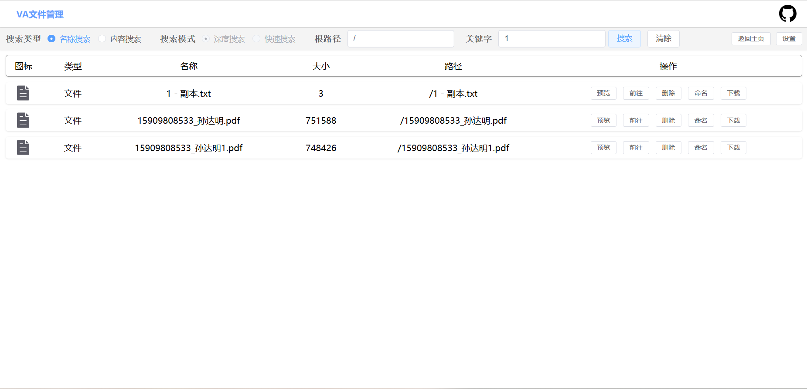
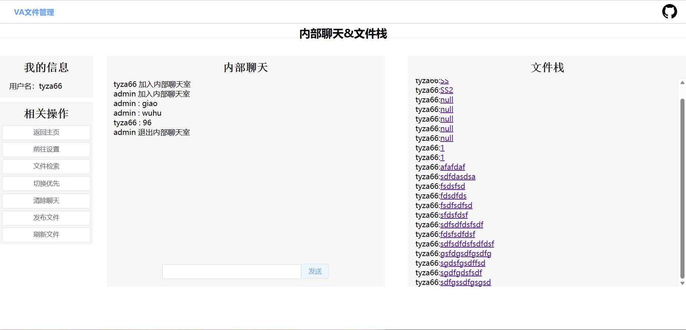
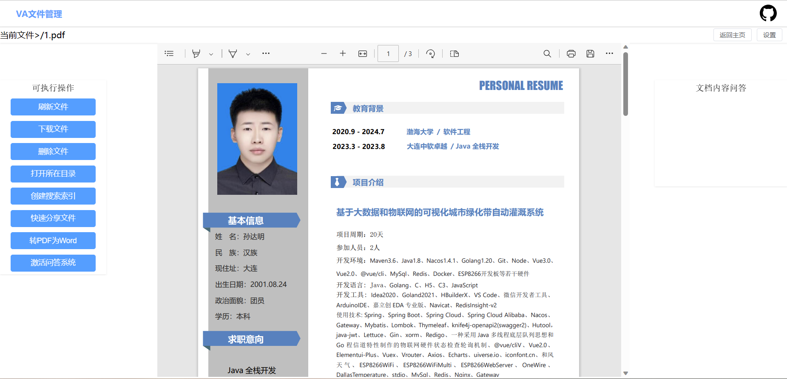
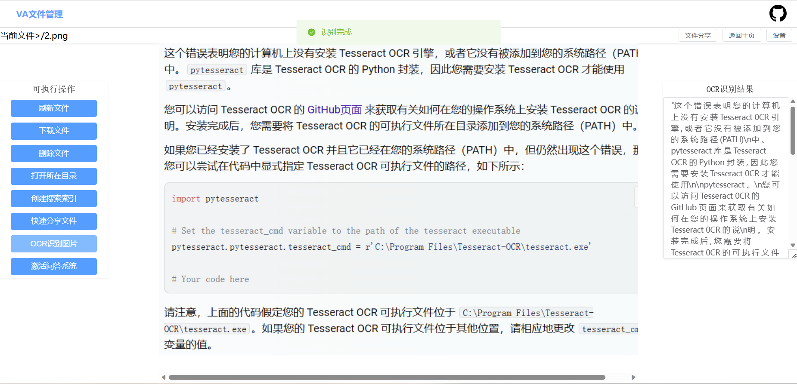
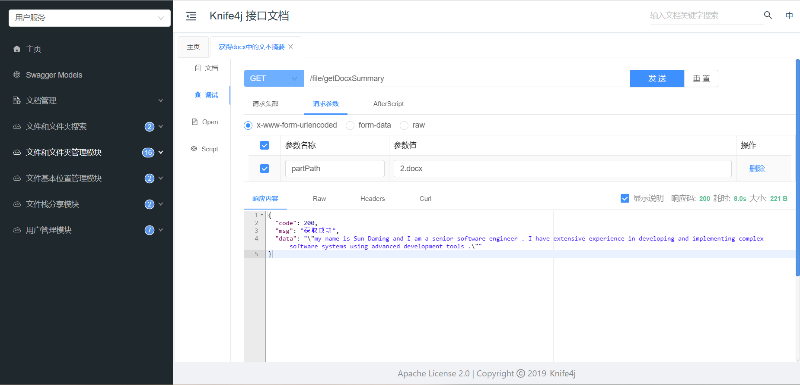
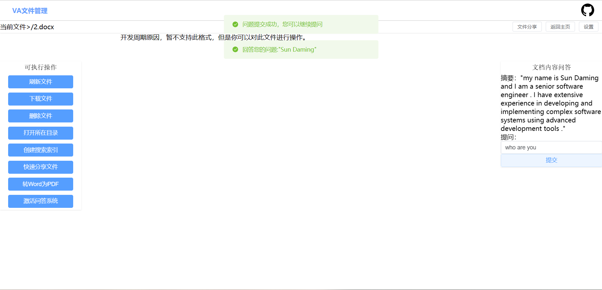

# VA-File
### VA-文件管理

##### 概述
- 主体使用Java实现的一个内部文件管理系统
- 支持一些基本的文档操作、一些高级智能功能
- 因为文件夹是使用的路径的形式进行访问的，使用这套系统的时候（并且没有进行文件夹网络映射的情况下），各个后端程序需要与树根文件夹在同一个设备上
- 如果想部署到外网使用，只有VAF-CORE的端口和前端端口需要映射，其他MIND的只在内网做分布式服务使用
- 文档分享的时候可以分享像关于根域名下的相对路径或者直接可访问，可下载的连接
- 手写分布式能起到的作用：异步、解耦、可进行平面拓展

##### 展示图

用户登录

文件管理

新建文件夹

新建文件

上传文件

设置

检索工具

在线聊天和文件分享

在线预览文件

OCR识别图片

文章摘要

智能问答

##### 预计实现功能
- [X] 用户登录
- [X] 文件夹管理
- [X] 文件管理
- [X] 文件上传
- [X] 文件下载
- [X] 文件内容检索
- [X] 内部通信（类似于网页微信）
- [X] 文档分享
- [X] 文档在线查看
- [X] 格式转换(例如word转PDF)
- [X] 基于NLP的文档检索系统(更换根文件的时候进行预检索)
- [X] 基于OCR的文档存储系统
- [ ] 基于ES的全文检索系统
- [X] 基于大模型的文档知识问答系统

##### 实现方案
- 文件夹管理：在计算机中，文件夹的结构是树结构，我们可以通过递归的方式检索根文件夹下的所有文件夹，并且如果想在前端展示的话，我们可以直接定义一个文件和文件夹公用的类进行同List返回文件夹内容，之后到前端用很容易区分的特征进行不同形式的展示
- 文件管理：文件发现和文件夹管理实现起来一样（原生Java中提供了相关功能），文件的添加删除直接使用IO流操作即可
- 文件上传、下载：使用Java的IO流操作，加上API处理，然后将文件被操作的相关信息存储到数据库中
- 文件内容检索：
    - 快速模式：正常直接检索没有保存主题的文件的时候，只对大小小于一定阈值并且直接可读的文件进行内容检索。每当新增文件的时候，根据文件大小来判断（为了提高检索速率）是否需要进行操作，如果文件过大，将直接可读的文件（txt或经转换过的纯文字文件等）的内容片段交给*语言模型*进行主题提取，将相关主题存储到数据库中，然后根据用户的检索内容，与检索内容相关的文件名返回。（这样虽然提高了效率，但是文件夹挂载前文件夹中存在的过大的文件无法被检索，为了解决这个问题，可以在更换根文件夹目录的操作中启动一个遍历生成能够完全检索原有文件的信息的线程进行并发操作），这种搜索的模式效率较快，但是需要预先进行准备
    - 深度模式：直接通过读取文件内容的形式判断文件内容中是否包含关键字，支持的格式有所有文本格式文件(text、java、c等)、docx、pdf。这种模式搜索的效率较慢
    - 文件名模式：直接搜索文件和文件夹名称中是否包含关键字，这种模式搜索的效率较快
- 更换根文件的时候进行预检索：在更换根文件夹目录的操作中启动一个遍历生成能够完全检索原有文件的信息的线程进行并发操作
- 内部通信：使用Socket长连接实现内部聊天
- 文档分享：这个原本可以使用Socket长连接进行实现，但是考虑到这个功能的使用场景，使用Socket会有一些不必要的麻烦，我这里面向完全使用HTTP短连接进行实现，所以进行的操作就是将分享文件操作放入Redis中（其实可以用消息队列），分享的文件分享信息默认过期时间是一天，然后在前端可以进行手动刷新或者轮询检查，如果有新的分享文件，就进行提示，然后进行下载操作
- 文档在线查看：如果是pdf，图片啥的，浏览器自身支持，直接通过修改响应请求头的方式进行响应在线访问就好了（我的node版本太高，不支持部分前端框架，比如pdfjs不支持，所以我走的是浏览器默认支持的路线，直接内嵌iframe），暂时就实现到文本文档，图片，pdf
- 格式转换：基本可以使用POI中自带的转换功能进行实现，但是我使用的是手打分分布式实现解耦异步，在MIND2中进行异步格式转换
- 基于NLP的文档检索系统：就是上面提到的快速检索，但是因为开发周期原因，暂时只能每个文件手动点击添加检索(因为这个模型运行很慢，要等很久响应时间)
- 基于OCR的文档存储系统：使用MIND2中的OCR库进行实现
- 基于ES的全文检索系统：需要用到Elasticsearch，还待研究
- 基于大模型的文档知识问答系统：在MIND0中使用HuggingFace的GPT2.0进行实现

##### 后端程序
- 环境：Java8、MySQL、Redis、Docker、Redis
- Java后端使用技术：Spring、Spring Boot、MyBatis、MyBatis Plus、Knife4j、Hutool、Sa-Token、Lettuce、POI、WebSocket
- Python后端使用技术：FastAPI、Uvicorn、HuggingFace、GPT2.0、TensorFlow、Transformers、PyPDF2、Docx2txt、Tesseract-OCR、Docx2pdf、Pdf2docx、PIL、Pytesseract
- Java后端(VAF-CORE)端口：9090
- 响应代码：198错误、199失败、200成功、201权限不足
- Python后端
    - VAF-MIND0端口：9091 （主要管理AI模型）
    - VAF-MIND1端口：9092 （主要管理文件检查）
    - VAF-MIND2端口：9093 （主要管理文件转换）

##### 前端程序
- 环境：Node、Vue3.0
- Web前端使用技术：Element-plus、Axios、Vue-router、Vuex、iconfont
- 前端端口：8080

##### 本地复现
- 准备环境
- 启动Redis、启动MySQL
- 导入数据库结构
- 引入Java后端的maven依赖，配置数据库信息，启动SpringBoot后端（可以访问/doc.html查看swagger2文档）
- 启动多个Python后端（第一次启动需要很长时间和好的网络环境下载AI模型）
- 启动Vue前端
- 前往localhost:8080进行测试

##### 可改进的地方
- 内容检索的时候，可以使用多线程进行并发操作，还可以在前面页检测到就直接返回，不用等待所有的文件都检索完毕
- 可以增加文件移动的功能（没增加之前只能先下载、再重命名、再上传）
- 将来也许可以拓展支持FTP文件服务
- 文档问答目前只支持英文，可以通过更换更好更先进的语言模型来实现中文的问答

##### V计划
- https://github.com/tyza66/ProjectV

By：tyza66
